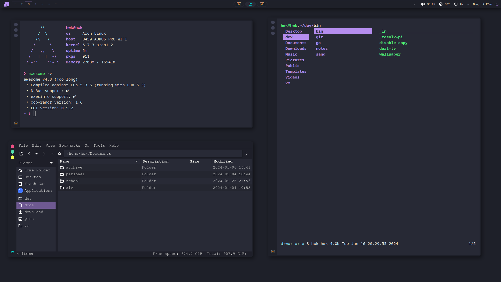

# Personal Dotfiles

 

<hr />

<p align="center">
    
</p>

<hr />

## Setup

This will only setup `awesome`, nothing in `/ext`. Everything in `/ext` only exists as a personal backup. I don't use `awesome-git`. As of now, I'm using v4.3. If SVG icons don't show, install `librsvg`.

```sh
$ cp .config.json config.json
$ cp bin/.autostart bin/autostart
$ chmod +x bin/autostart

$ nano config.json # hotkeys, bindings, layout, etc...
$ nano bin/autostart # autostart script
```

## License

[MIT](LICENSE)
